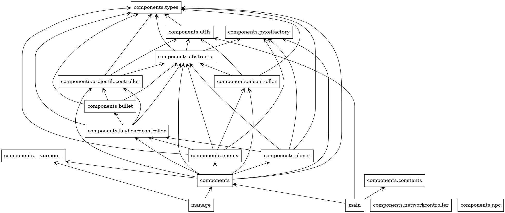
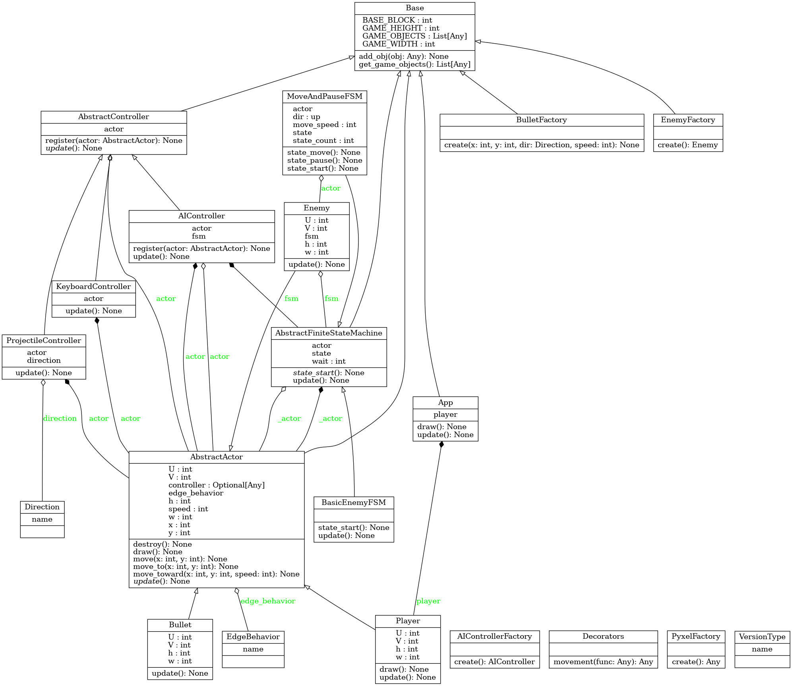

# resurrection-man
grave robbing and other fun things

# dependencies
[pyenv](https://github.com/pyenv/pyenv#automatic-installer)

[pipenv](https://pipenv.pypa.io/en/latest/)

`python -m pip install pipenv`

[make](https://www.technewstoday.com/install-and-use-make-in-windows/)

`winget install gnuwin32.make`

*on a real OS this isn't a problem, but on windows you gotta use gnumake*

# getting started
*install the dependencies listed above*

make sure that `python` is a valid command

if not set alias in `.bashrc` and run `source ~/.bashrc`

*set alias in `.bashrc`*

`alias python='python3'`

*install and run*

`python -m pipenv install`

`make run`

# editing assets
`make edit`

# type checking
`make types`

# uml
`make uml`

might require graphviz

`brew install graphviz`

or

`apt-get install graphviz`

## Packages

## Classes

