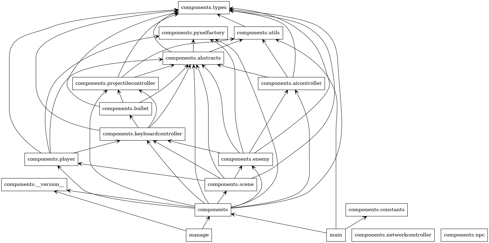
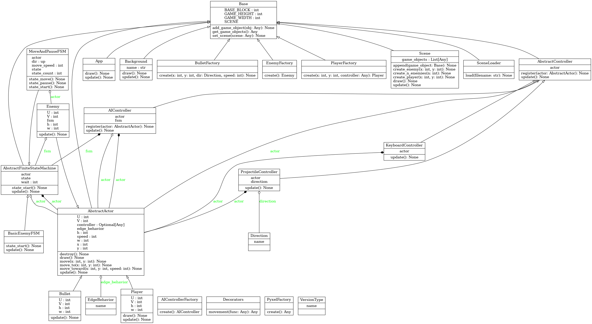

# resurrection-man
grave robbing and other fun things

# dependencies
[pyenv](https://github.com/pyenv/pyenv#automatic-installer)

[pipenv](https://pipenv.pypa.io/en/latest/)

`python -m pip install pipenv`
(This installs pip which will later be used to set up pipenv. Try not to confuse the commands via terminal history like amp did)

[make](https://www.technewstoday.com/install-and-use-make-in-windows/)

`winget install gnuwin32.make`

don't forget to add make to the path in windows. example: `C:\Program Files (x86)\GnuWin32\bin`

*on a real OS this isn't a problem, but on windows you gotta use gnumake*

# getting started

WSL causes more problems than its worth, use native dev tools if you're using Windows. [See this issue](https://github.com/Murder-Hobo-Interactive/resurrection-man/issues/15)

*install the dependencies listed above*

make sure that `python` is a valid command

if not set alias in `.bashrc` and run `source ~/.bashrc`

*set alias in `.bashrc`*

`alias python='python3'`

*install and run*

`python -m pipenv install`

`make run`

# editing assets
`make edit`

# type checking
`make types`

# uml
`make uml`

might require graphviz

`brew install graphviz`

or

`apt-get install graphviz`

## Sprite Info
# Null Item
U, V Coordinates: 0,0
W: 16, H: 16
Description: If nothing else, there is this item. Use as a placeholder. 

# Trap Item
U, V Coordinates: 0,16
W: 16, H: 16
Description: Meant to be implemented as a stationary hazard. Use however you see fit. 

# Tomb Stone
U, V Coordinates: 0,32
W: 16, H: 16
Description: Has ressurection mans initials on it. Could be used for power ups, or just to show where they died. 

# Bullet Right
U, V Coordinates: 0, 48
W: 16, H: 16
Description: Sprite of a bullet facing right

# Bullet Left
U, V Coordinates: 0, 64
W: 16, H: 16
Description: Sprite of a bullet facing left

# Bullet Up
U, V Coordinates: 0, 80
W: 16, H: 16
Description: Sprite of a bullet facing up

# Bullet Down
U, V Coordinates: 0, 96
W: 16, H: 16
Description: sprite of a bullet facing down

# Demon Entity Left
U, V Coordinates: 16, 0
W: 32, H: 32
Description: sprite of a bad guy facing left

# Demon Entity Right
U, V Coordinates: 16, 32
W: 32, H: 32
Description: sprite of a bad guy facing right

# Ressurrection Man Normal
U, V Coordinates: 16, 64
W: 32, H: 32
Description: our main character in his normal state

# Ressurection Man Ultimate
U, V Coordinates: 16, 96
W: 32, H: 32
Description: our main character going beast mode or something idk

# Ground Tiles
U, V Coordinates: 48, 0
W: 48, H: 96
Description: The floor

## Packages

## Classes

